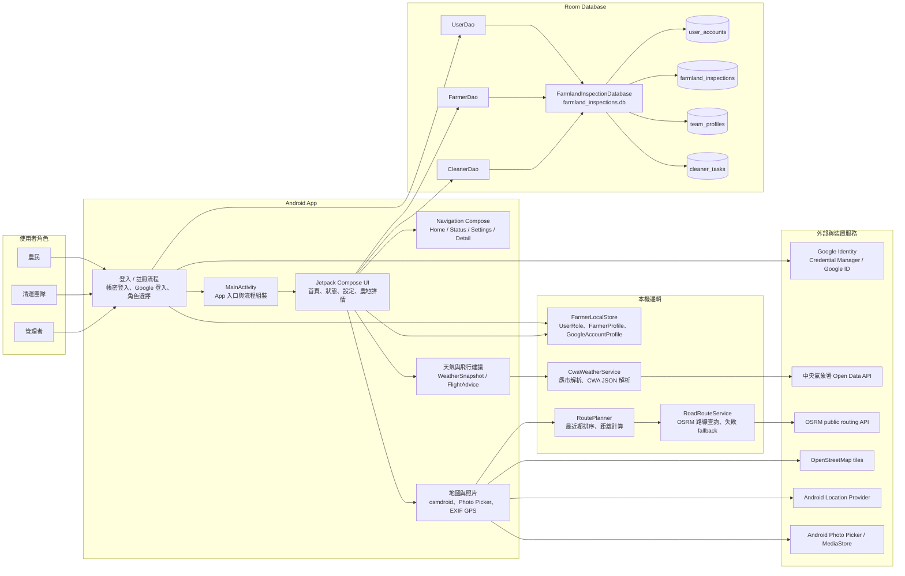
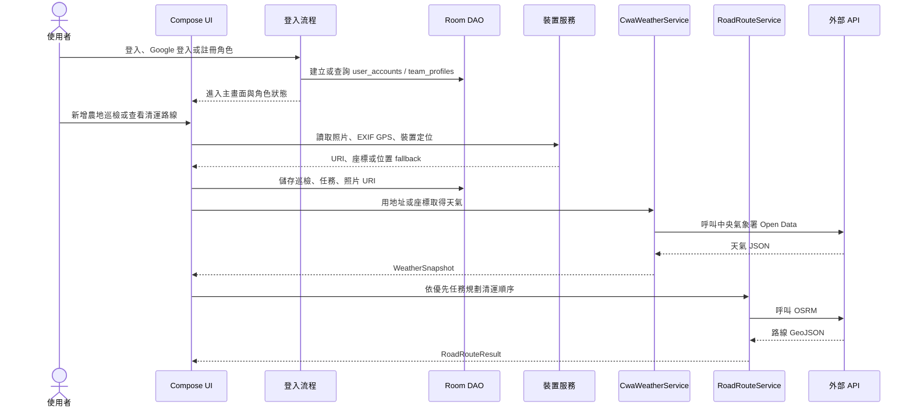
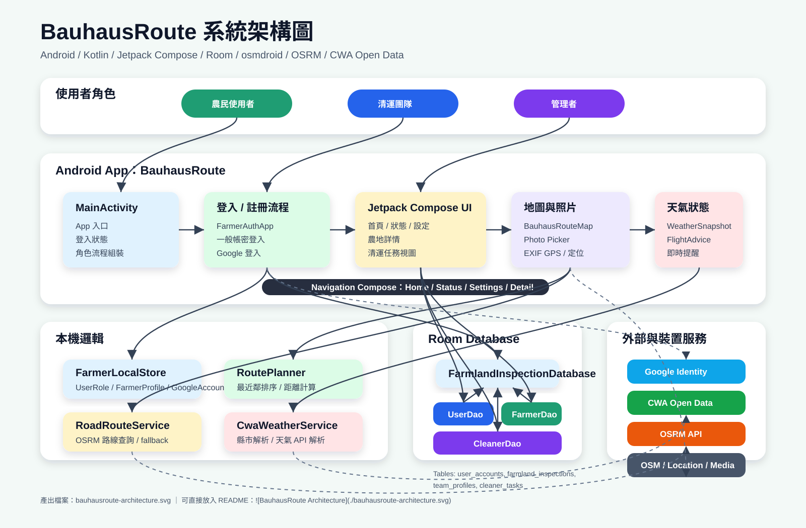

# BauhausRoute 架構圖

此文件整理 BauhausRoute Android 專案目前的主要模組、資料流與外部服務依賴。

## 系統架構



## 資料流



## 主要檔案職責

| 檔案 | 職責 |
| --- | --- |
| `app/src/main/java/com/example/bauhausroute/MainActivity.kt` | App 入口、Compose UI、登入流程、導覽、地圖、照片、定位與畫面狀態 |
| `app/src/main/java/com/example/bauhausroute/FarmlandInspectionDatabase.kt` | Room entities、DAO、資料庫 singleton 與 migration |
| `app/src/main/java/com/example/bauhausroute/FarmerLocalStore.kt` | 使用者角色與登入後 profile model |
| `app/src/main/java/com/example/bauhausroute/RoutePlanner.kt` | 清運點最近鄰排序與座標距離計算 |
| `app/src/main/java/com/example/bauhausroute/RoadRouteService.kt` | 呼叫 OSRM、解析路線、路線失敗時 fallback |
| `app/src/main/java/com/example/bauhausroute/CwaWeatherService.kt` | 呼叫中央氣象署 Open Data、解析天氣資料 |

## 圖片檔

架構圖圖片已輸出為：

```text
bauhausroute-architecture.svg
```

可在 README 中引用：

```md

```
