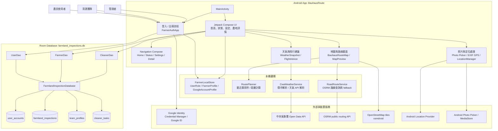
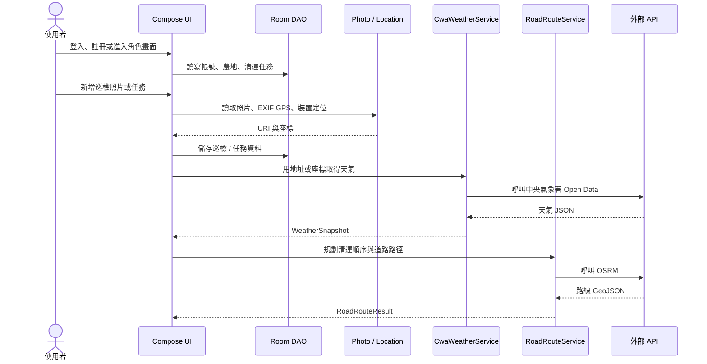

# BauhausRoute 架構圖

## 分層說明

| 層級 | 主要檔案 / 元件 | 職責 |
| --- | --- | --- |
| 使用者入口 | `MainActivity.kt` | App 入口、登入狀態、角色流程與主要 Compose 畫面組裝 |
| UI 與導覽 | `MainActivity.kt`、Navigation Compose | 農民 / 清運角色畫面、底部導覽、農地詳情、地圖與設定頁 |
| 本機資料 | `FarmlandInspectionDatabase.kt` | Room entities、DAO、資料庫 migration、本機帳號與任務資料 |
| 帳號模型 | `FarmerLocalStore.kt` | 使用者角色、農民 profile、Google 帳號 profile |
| 路線規劃 | `RoutePlanner.kt`、`RoadRouteService.kt` | 清運點排序、距離計算、OSRM 路線查詢，失敗時回退成直線路徑 |
| 天氣資料 | `CwaWeatherService.kt` | 依地址或 GPS 推估縣市，呼叫中央氣象署 Open Data 並轉成 App 天氣模型 |
| 裝置能力 | Android Location、Photo Picker、EXIF | 取得位置、照片 URI、照片 GPS 資訊與本機媒體讀取權限 |
| 外部服務 | Google Identity、OSRM、OpenStreetMap、CWA | Google 登入、道路路線、地圖圖資、天氣資料 |

## 資料流摘要

