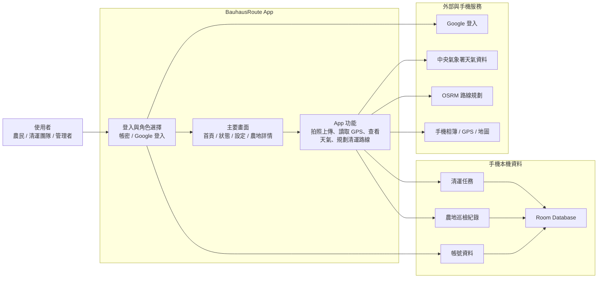

# BauhausRoute 簡易架構圖

這張圖用「使用者做什麼、App 怎麼處理、資料存在哪裡、會呼叫哪些外部服務」來說明專案架構。



## 用一句話說明

BauhausRoute 是一個 Android App：使用者登入後，可以新增農地巡檢紀錄、照片與 GPS 位置；App 會把資料存進手機本機 Room Database，並視需要呼叫 Google 登入、中央氣象署天氣、OSRM 路線與手機定位/相簿服務。

## 專案檔案對照

| 區塊 | 對應檔案 | 白話說明 |
| --- | --- | --- |
| App 入口與畫面 | `MainActivity.kt` | 大部分畫面、登入流程、導航、地圖、天氣顯示都在這裡 |
| 本機資料庫 | `FarmlandInspectionDatabase.kt` | 儲存帳號、農地巡檢、清運團隊與清運任務 |
| 使用者資料 | `FarmerLocalStore.kt` | 定義農民、清運人員、管理者等角色資料 |
| 路線排序 | `RoutePlanner.kt` | 幫清運點排序，計算兩點距離 |
| 道路路線 | `RoadRouteService.kt` | 呼叫 OSRM，取得道路路線 |
| 天氣資料 | `CwaWeatherService.kt` | 呼叫中央氣象署 Open Data，取得天氣 |

## 圖片檔

可直接使用這張簡化版圖片：

```text
bauhausroute-simple-architecture.svg
```

README 可這樣引用：

```md

```
