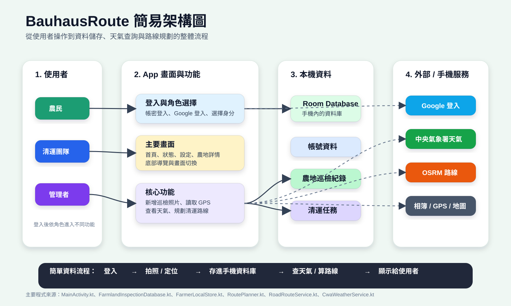

# BauhausRoute

BauhausRoute 是一款以農地巡檢、環境通報與清運路線規劃為核心的 Android App。農民可以建立農地巡檢紀錄、上傳現場照片並保留 GPS 資訊；清運團隊可以依照任務優先度查看地圖、天氣與路線，協助安排清運順序。

## 專案特色

- 農民與清運團隊角色註冊、登入與切換
- 支援一般帳密登入與 Google 登入
- 建立、瀏覽、篩選與刪除農地巡檢紀錄
- 讀取照片 EXIF GPS 座標，將巡檢地點標示在地圖上
- 依垃圾數量、嚴重程度與時間建立清運優先順序
- 使用 OpenStreetMap 顯示地圖、標記與路線
- 串接 OSRM 規劃道路路線，失敗時改用距離估算
- 串接中央氣象署 Open Data，提供天氣與作業建議
- 使用 Room Database 儲存本機帳號、巡檢資料與清運任務
- 支援明亮、深色與跟隨系統外觀模式

## 技術棧

| 類別 | 技術 |
| --- | --- |
| 平台 | Android |
| 語言 | Kotlin |
| UI | Jetpack Compose、Material 3 |
| 架構元件 | Lifecycle、Navigation Compose |
| 資料庫 | Room |
| 地圖 | osmdroid、OpenStreetMap |
| 路線 | OSRM |
| 天氣 | 中央氣象署 Open Data API |
| 圖片 | Coil、ExifInterface |
| 登入 | Android Credential Manager、Google ID |

## 架構概覽



更多架構說明請參考：

- [ARCHITECTURE.md](./ARCHITECTURE.md)：完整系統架構與資料流
- [ARCHITECTURE_SIMPLE.md](./ARCHITECTURE_SIMPLE.md)：簡化版架構說明

## 環境需求

- Android Studio
- JDK 17 或以上版本
- Android SDK 36
- Gradle Wrapper 9.3.1
- 最低支援版本：Android 8.0（API 26）

## 專案設定

### Google 登入

Google 登入需要先設定 Web Client ID。請修改：

```text
app/src/main/res/values/strings.xml
```

將預設值替換成你的 Google Web Client ID：

```xml
<string name="google_web_client_id" translatable="false">YOUR_GOOGLE_WEB_CLIENT_ID</string>
```

### 天氣 API

目前 `CwaWeatherService.kt` 內有中央氣象署 API 授權碼。若要公開上傳 GitHub，建議先撤換該授權碼，並改成從不提交到版本控制的設定檔或 BuildConfig 欄位讀取。

## 建置與執行

使用 Android Studio 開啟專案後，等待 Gradle Sync 完成，即可直接執行 App。

也可以在 Windows PowerShell 執行：

```powershell
.\gradlew.bat assembleDebug
```

Debug APK 產出位置：

```text
app/build/outputs/apk/debug/app-debug.apk
```

## 權限說明

| 權限 | 用途 |
| --- | --- |
| `INTERNET` | 載入地圖、規劃路線與取得天氣資訊 |
| `ACCESS_FINE_LOCATION` | 取得裝置精確位置 |
| `ACCESS_COARSE_LOCATION` | 取得約略位置，作為定位備援 |

## 專案結構

```text
BauhausRoute/
├── app/
│   └── src/main/
│       ├── AndroidManifest.xml
│       ├── java/com/example/bauhausroute/
│       │   ├── MainActivity.kt
│       │   ├── FarmlandInspectionDatabase.kt
│       │   ├── CwaWeatherService.kt
│       │   ├── RoadRouteService.kt
│       │   ├── RoutePlanner.kt
│       │   └── FarmerLocalStore.kt
│       └── res/
├── gradle/
├── ARCHITECTURE.md
├── ARCHITECTURE_SIMPLE.md
├── bauhausroute-architecture.svg
├── bauhausroute-simple-architecture.svg
├── build.gradle.kts
├── settings.gradle.kts
└── README.md
```

## GitHub 分支

目前主要更新分支：

```text
docs/architecture-and-ui-polish
```

此分支包含：

- README 與架構文件整理
- 完整版與簡化版架構圖
- UI 互動穩定性修正
- 深色 / 明亮 / 跟隨系統外觀模式

推送目前分支：

```powershell
git push
```

## 不應提交的內容

請確認不要提交以下內容：

- `local.properties`
- `.gradle/`
- `.idea/`
- `.kotlin/`
- `build/`
- `app/build/`
- `_github_upload_20260524-220605/`

## 公開前檢查清單

- 確認 API Key、Client ID、Token 沒有直接暴露在公開 Repository
- 確認 `_github_upload_20260524-220605/` 備份資料夾沒有被提交
- 確認 `app/build/` 等建置產物沒有被提交
- 確認 `google_web_client_id` 已替換成正式設定，或保留為範例值
- 使用 Android Studio 完成 Gradle Sync 與 Debug Build

## 目前狀態

本專案仍在開發階段，資料主要儲存在裝置本機。地圖、路線與天氣功能需要網路連線；Google 登入與中央氣象署資料則需要額外設定對應服務金鑰。
